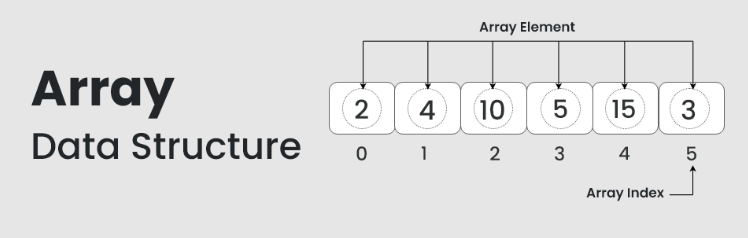
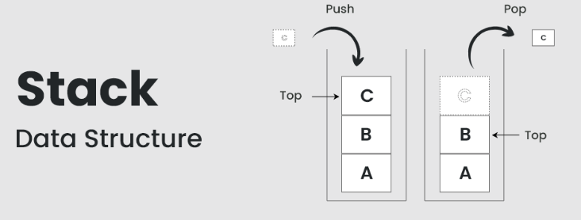
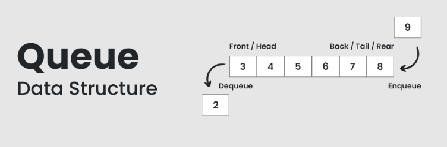
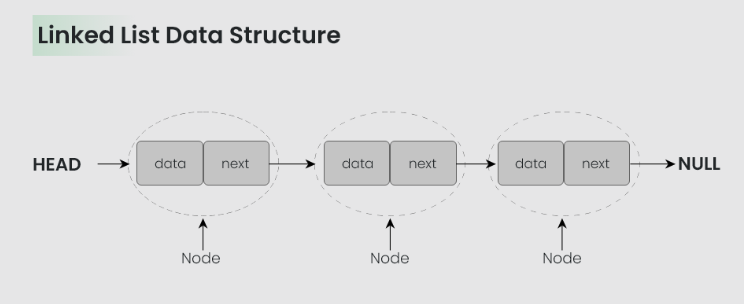
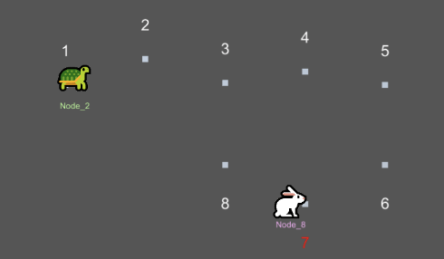
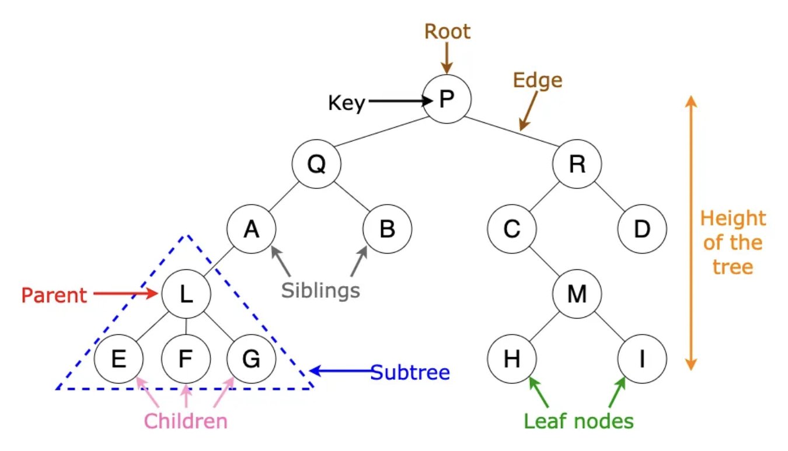
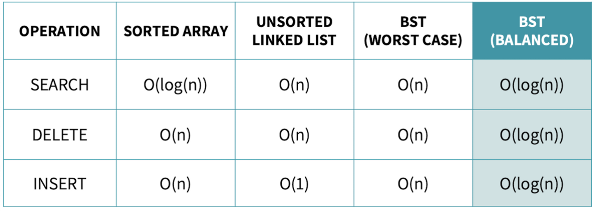

# The Core of Computer Science

2023 KUCC CS SESSION
Jay Oh

--- 
## Content
- What is Data Structure
- The Category of Data Structure
- Quick review - Linear Structure
- Quick review - Non-linear Structure
- Quick review - File Structure
- How can we use it?
- Exercise
---
### What is Data Structure

A data structure is not only used for organizing the data. It is also used for *processing*, *retrieving*, and *storing data*. There are different basic and advanced types of data structures that are used in almost every program or software system that has been developed. So we must have good knowledge about data structures.

---
### The Category of Data Structure

---
- Linear data structure: Data structure in which data elements are arranged sequentially or linearly, where each element is attached to its previous and next adjacent elements, is called a linear data structure. 
Examples of linear data structures are array, stack, queue, linked list, etc.

- Non-linear data structure: Data structures where data elements are not placed sequentially or linearly are called non-linear data structures. In a non-linear data structure, we can’t traverse all the elements in a single run only. 
Examples of non-linear data structures are trees and graphs.
---
- Static data structure: Static data structure has a fixed memory size. It is easier to access the elements in a static data structure. 
An example of this data structure is an array.

- Dynamic data structure: In dynamic data structure, the size is not fixed. It can be randomly updated during the runtime which may be considered efficient concerning the memory (space) complexity of the code. 
Examples of this data structure are queue, stack, etc.

###### I expect that you guys sufficiently understand the importance of the data structure, so from now on, Let dive into the Data Structure!
---
### Quick review - Linear Structure
What is Array?
- An array is a collection of items stored at contiguous memory locations. The idea is to store multiple items of the same type together. This makes it easier to calculate the position of each element by simply adding an offset to a base value, i.e., the memory location of the first element of the array (generally denoted by the name of the array).

---
### Quick review - Linear Structure
what is Stack?
- Stack is a linear data structure that follows a particular order in which the operations are performed. The order may be LIFO(Last In First Out) or FILO(First In Last Out). LIFO implies that the element that is inserted last, comes out first and FILO implies that the element that is inserted first, comes out last.

- postfix notation, DFS, BackTracking, calling, reverse parsing

---
### Quick review - Linear Structure
Quick Question 
1.  what is stack overflow?
   - it happen when we try to store more memory that stack have
   - e.g. when we call the recursion function tooooooo many
   - so we should check the memory of stack we try to use

---
### Quick review - Linear Structure
what is Queue?
- A Queue is defined as a linear data structure that is open at both ends and the operations are performed in First In First Out (FIFO) order.
- os scheduling, BFS, linear scehduling

---
Quick Question
1. the implementaion of circular queue?
2. the implementation of priority queue?
3. when we try to make stack ot queue, there exist two way: arrat or linked list. what is the pros and cons?

---
### Quick review - Linear Structure
what is Linked list?
- A linked list is a linear data structure, in which the elements are not stored at contiguous memory locations. The elements in a linked list are linked using pointers as shown in the below image:

- sequential access, we can assign memory dynamically to node
---
Quick Question
1. How can we know cycle in linked list?
- tortoise & hare algorithm

---
### Quick review - Non-linear Structure
what is Binary tree?
- Binary Tree is defined as a tree data structure where each node has at most 2 children. Since each element in a binary tree can have only 2 children, we typically name them the left and right child.
- it is the special form of graph which have no cycle

---

- how can we know the height of binary tree?
- what is AVL tree?
- what is Red-Black tree?

---
Quick Question
1. what is the difference of the Binary tree and Binary Search tree?
2. what is the problem of binary search tree? is it always good?

---
### How can we use it?

---
What we have learned...

- array, stack, queue, linked list
- tree
  
what we didn't learn and what should you know

- graph, hash etc..
---
### Exercise

#1 
a) A self - _____ structure is used to form dynamic data structures.

b) Function _____ is used to dynamically allocate memory.

c) A(n) _____ is a specialized version of a linked list in which nodes can be inserted and deleted only from the start of the list.

d) Functions that look at a linked list but do not modify it are referred to as _______.

e) A queue is referred to as a(n) _____ data structure.

---
f) The pointer to the next node in a linked list is referred to as a(n) _____.

g) Function _____ is used to reclaim dynamically allocated memory.

h) A(n) _____ is a specialized version of a linked list in which nodes can be inserted only at the start of the list and deleted only from the end of the list.

i) A(n) _____ is a nonlinear, two-dimensional data structure that contains nodes with two or more links.

j) A stack is referred to as a(n) _____ data structure because the last node inserted is the first node removed.

---
k) The nodes of a(n) _____ tree contain two link members.

l) The first node of a tree is the _____ node.

m) Each link in a tree node points to a(n) _____ or ____ of that node.

n) A tree node that has no children is called a(n) _____.

o) The three traversal algorithms(covered in this chapter)for a binary tree are_____ , _____ and _____ .

---

#2
what are the differences between a linked list and a stack?

#3 
what are the differences between a stack and a queue?

---
### Solution
#1
a) referential. b) malloc. c) stack. d) predicates. e) FIFO. f) link. g) free. h) queue.
i) tree. j) LIFO. k) binary. l) root. m) child, subtree. n) leaf. o) in-order, pre-order, post-order.

#2
It’s possible to insert a node anywhere in a linked list and remove a node from anywhere in a linked list. However, nodes in a stack may be inserted only at the top of the stack and removed only from the top of a stack.

---
#3
A queue has pointers to both its head and its tail so that nodes may be inserted at the tail and deleted from the head. A stack has a single pointer to the top of the stack where both insertion and deletion of nodes is performed.